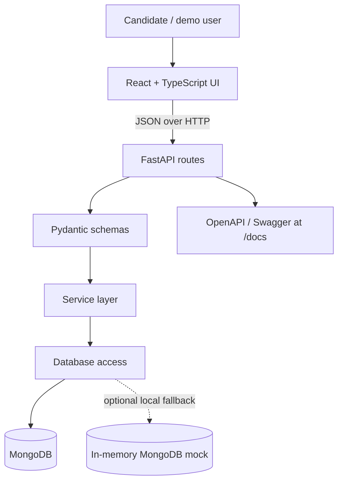

# System Architecture & Data Model

Comprehensive technical architecture for the **FuelFlux Hydrotesting Management System**.

---

## 🏛 High-Level Architecture

The application follows a modular, 3-tier architecture:

---

## 🗄 Data Model & Schema Design

The system models two primary MongoDB collections: `assets` and `records`.

### 1. `assets` Collection
Stores registered equipment and their certification schedules.

| Field | Type | Validation / Constraints | Description |
|---|---|---|---|
| `asset_id` | String | **Unique**, uppercase, required | Equipment identifier (e.g. `FF-TK-101`) |
| `station` | String | Required, trimmed | Location / Site (e.g. `Station Alpha`) |
| `asset_type` | String | Required | Type (e.g. `Storage Tank`, `Fuel Pipeline`) |
| `serial_number` | String | Required | Equipment serial / reference number |
| `test_date` | Date (`YYYY-MM-DD`) | Required | Date of last hydrotest |
| `next_due_date` | Date (`YYYY-MM-DD`) | Required, $\ge$ `test_date` | Next certification deadline |
| `status` | String | `Active`, `Maintenance`, `Inactive`, etc. | Equipment operational status |
| `created_at` | DateTime (ISO) | Immutable | Record creation timestamp |
| `updated_at` | DateTime (ISO) | Auto-refreshed | Last modified timestamp |
| `hydrotest_count` | Integer | Calculated | Number of linked tests |
| `latest_test_result` | String / Null | `Pass`, `Fail`, `Pending`, or `null` | Most recent test outcome |

**Indexes:**
- `asset_id`: Unique index (`{ asset_id: 1 }, { unique: true }`)
- `next_due_date`: Ascending index for due-date queries
- `station`, `asset_type`, `status`: Single-field indexes for filtering

---

### 2. `records` Collection
Stores certified hydrostatic pressure test logs linked to equipment assets.

| Field | Type | Validation / Constraints | Description |
|---|---|---|---|
| `record_id` | String | **Unique**, uppercase | Test record ID (e.g. `HTR-2026-0005`) |
| `asset_id` | String | **Foreign Key** (Must exist in `assets`) | Referenced asset identifier |
| `test_date` | Date (`YYYY-MM-DD`) | Required | Date inspection took place |
| `performed_by` | String | Required | Provider / inspector name |
| `result` | Enum | `Pass`, `Fail`, `Pending` | Inspection outcome |
| `notes` | String | Optional, max 1000 chars | Pressure hold notes & observations |
| `report_filename` | String | Optional, sanitized | Safe document reference (e.g. `HT-REP-2026.pdf`) |
| `created_at` | DateTime (ISO) | Immutable | Record creation timestamp |
| `updated_at` | DateTime (ISO) | Auto-refreshed | Last modified timestamp |

**Indexes:**
- `record_id`: Unique index
- `asset_id`: Index for retrieving asset test history
- `test_date`: Descending index for chronological sorting
- `result`: Index for filtering by Pass/Fail/Pending

---

## 📅 Due-Date & Validity Calculation Rules

Validity status is calculated dynamically relative to the reference date (`today`):

$$\text{days\_until\_due} = \text{next\_due\_date} - \text{today}$$

### Status Rules:
1. **Valid:** `next_due_date >= today` AND latest test result $\neq$ `Fail`.
2. **Due Soon:** `today <= next_due_date <= today + 30 days` (inclusive).
3. **Overdue:** `next_due_date < today`.

### Failed & Pending Test Interactions:
- **Failed Records:** When a hydrotest fails (pressure drop, leak, rupture), the asset status is updated to `Maintenance`. Even if the previous calendar validity date is in the future, the asset is treated as non-compliant until a passing re-test is logged.
- **Pending Records:** Tests under observation or awaiting engineering sign-off are marked `Pending`. The asset remains in its existing state until the certification is finalized.
